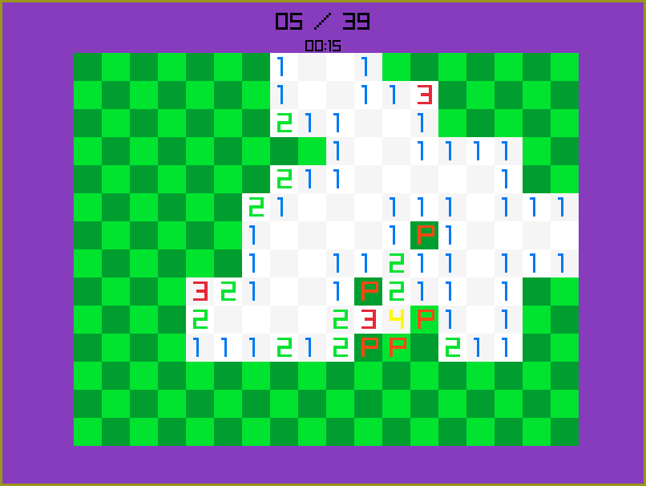

# Minesweeper

Welcome to Minesweeper, a classic game implemented in C using the raylib graphics library.

## Play Online
Experience Minesweeper web version: [vmisovic.github.io/minesweeper/game.html](https://vmisovic.github.io/minesweeper/game.html)

## How to Play
- **Open Field:** Right-click to open a field.
- **Place Flag:** Left-click to place a flag.
- **Remove Flag:** Middle-click to remove a flag.
- **Zoom In/Out:** Use the scroll wheel to zoom.
- **Move Field:** Hold left control and right-click to move.
- **Game Menu:** Press 'M' to open the game menu, where you can start a custom-sized game.

**Pro Tip:** Click and drag to open/place flags on multiple fields faster.

## Compilation

### For LINUX

#### Install raylib via Package Manager (Arch Linux)
```bash
sudo pacman -S raylib
```
#### Alternatively, compile raylib from source
```
git clone https://github.com/raysan5/raylib.git
cd raylib/src/
```
Note: You may need to change the `-L` compiler flag in the Makefile.
```
make run
```

### For WEB

#### Install Emscripten (Arch Linux)
```
sudo pacman -S emscripten
source /etc/profile.d/emscripten.sh
```
Or install from the GitHub repo:
```
git clone https://github.com/emscripten-core/emsdk.git
source emsdk/emsdk_env.sh
```


#### Compile raylib for WEB
```
git clone https://github.com/raysan5/raylib.git
cd raylib/src/
make PLATFORM=PLATFORM_WEB -B
```
Ensure `libraylib.a` has been generated:
```
ls libraylib.a
```
Move to the project root and execute:
```
make web
```
To preview in the browser, start a local web server:
```
cd web
python3 -m http.server
```
Connect to `localhost:8000/game.html` in your browser.

## GitHub Actions

If you fork this repo and push changes to master, a new program version will be generated. Adjust these settings for your repo:

1. Allow GitHub Actions to read and write to your repo under **Actions/Workflow permissions**.
2. In the **Pages** settings, select the `gh-pages` branch as the source of deployment.

Your Minesweeper version will be available at:
`[your username].github.io/minesweeper/game.html`
